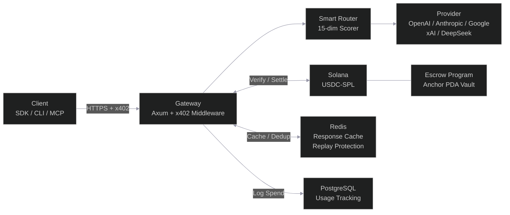
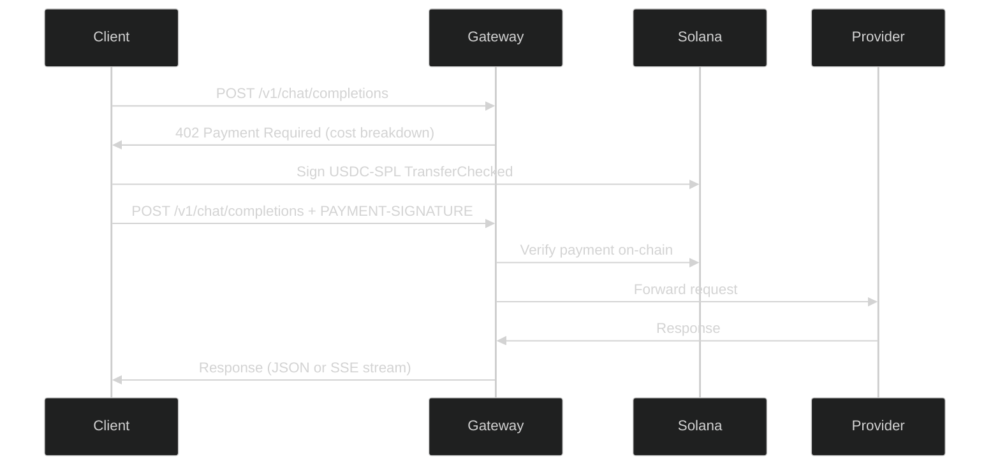

# Solvela

Solana-native AI agent payment gateway. No API keys, no accounts -- just wallets.


[](https://github.com/solvela-ai/solvela/actions/workflows/ci.yml)


AI agents pay for LLM API calls with USDC-SPL on Solana via the [x402 protocol](https://www.x402.org/). The gateway verifies payments on-chain, routes requests through a 15-dimension smart scorer, and proxies to the optimal provider. All settlement happens in USDC on Solana -- no custodial accounts, no subscription tiers, no invoices.

---

## Architecture



---

## Features

### Smart Routing

15-dimension rule-based scorer classifies requests into complexity tiers (Simple, Medium, Complex, Reasoning) and maps them to optimal models. microsecond-scale, zero external calls per scoring decision. Routing profiles: `eco`, `auto`, `premium`, `free`. Aliases: `fast`, `cheap`, `smart`, `best`, `reason`, `code`, `creative`, `analyze`.

### x402 Payments

USDC-SPL payments on Solana via the x402 protocol. Two payment schemes: direct `TransferChecked` (pre-signed) and trustless Anchor escrow with PDA vaults (deposit/claim/refund). Ed25519 signature verification, ATA derivation, replay protection via Redis `SET NX EX`.

### Multi-Provider Support

OpenAI, Anthropic, Google, xAI, and DeepSeek. Provider adapters translate between the gateway's OpenAI-compatible format and each provider's native API. Circuit breaker per provider with automatic fallback.

### Service Marketplace

Proxy any x402-enabled external service through the gateway. Admin-controlled registration with SSRF prevention, background health monitoring, and 5% platform fee on all proxied requests.

### Prometheus Monitoring

15 production metrics behind an admin-gated `/metrics` endpoint. Request counters, duration histograms, payment status, provider latency, cache hit rates, escrow claim tracking, and fee payer balance gauges. All metrics prefixed with `solvela_`.

### SDKs

Client libraries for Python, TypeScript, and Go. Each SDK includes wallet management, on-chain signing, response caching, session tracking, degraded response detection, and a 7-step smart chat flow. MCP server for Claude Code, Cursor, Claude Desktop, and OpenClaw integration.

The `solvela` CLI includes a host-config installer that sets up the MCP server in one command:

```bash
solvela mcp install --host=claude-code    # delegates to claude mcp add (user scope)
solvela mcp install --host=cursor         # writes ~/.cursor/mcp.json with envFile
solvela mcp install --host=claude-desktop # writes platform-specific config
solvela mcp install --host=openclaw       # runs openclaw mcp set solvela ...
```

The installer never writes `SOLANA_WALLET_KEY` to disk. Store it in `~/.solvela/env`
(chmod 0600) or your shell profile. See the [MCP server security guide](sdks/mcp/README.md#security) for details.

### Security

- Payment verification: ed25519 signature + ATA derivation + `TransferChecked` discriminator
- Replay prevention: Redis `SET NX EX 120` on transaction signatures
- Prompt guard: injection, jailbreak, and PII detection middleware
- Rate limiting: per-wallet (pubkey), not spoofable via `X-Forwarded-For`
- CORS: explicit allowlist, no wildcard
- Secret redaction: custom `Debug` impls on all config structs

---

## Quick Start

### Prerequisites

- Rust 1.85+
- Docker and Docker Compose (for PostgreSQL + Redis)
- At least one LLM provider API key

### Build and Run

```bash
git clone https://github.com/solvela-ai/solvela.git
cd Solvela
cargo build
```

Start backing services and configure the environment:

```bash
docker compose up -d
cp .env.example .env
```

Edit `.env` and add at least one provider API key (`OPENAI_API_KEY`, `ANTHROPIC_API_KEY`, etc.) and your Solana recipient wallet.

```bash
RUST_LOG=info cargo run -p gateway
```

The gateway listens on `http://localhost:8402`.

### Make a Request

```bash
# Check pricing
curl http://localhost:8402/pricing | jq '.models[0]'

# Request a completion (returns 402 with cost breakdown)
curl -s -X POST http://localhost:8402/v1/chat/completions \
  -H "Content-Type: application/json" \
  -d '{"model": "auto", "messages": [{"role": "user", "content": "Hello"}]}'

# With payment (base64-encoded PAYMENT-SIGNATURE header)
curl -X POST http://localhost:8402/v1/chat/completions \
  -H "Content-Type: application/json" \
  -H "PAYMENT-SIGNATURE: <base64-encoded-payment>" \
  -d '{"model": "openai/gpt-4o", "messages": [{"role": "user", "content": "Hello"}]}'
```

---

## Payment Flow



The 402 response includes a `cost_breakdown` with per-token pricing, estimated totals, and accepted payment schemes (`exact` and optionally `escrow`). The client signs a USDC-SPL transfer for the quoted amount and retries with the signed payment in the `PAYMENT-SIGNATURE` header.

---

## Supported Models

| Provider | Model | Input (per 1M tokens) | Output (per 1M tokens) | Context |
|----------|-------|-----------------------|------------------------|---------|
| OpenAI | `gpt-5.2` | $1.75 | $14.00 | 400K |
| OpenAI | `gpt-4o` | $2.50 | $10.00 | 128K |
| OpenAI | `gpt-4o-mini` | $0.15 | $0.60 | 128K |
| OpenAI | `gpt-4.1` | $2.00 | $8.00 | 1M |
| OpenAI | `gpt-4.1-mini` | $0.40 | $1.60 | 1M |
| OpenAI | `gpt-4.1-nano` | $0.10 | $0.40 | 1M |
| OpenAI | `o3` | $2.00 | $8.00 | 200K |
| OpenAI | `o3-mini` | $1.10 | $4.40 | 200K |
| OpenAI | `o4-mini` | $1.10 | $4.40 | 200K |
| OpenAI | `gpt-oss-120b` | Free | Free | 128K |
| Anthropic | `claude-opus-4.6` | $5.00 | $25.00 | 200K |
| Anthropic | `claude-sonnet-4.6` | $3.00 | $15.00 | 200K |
| Anthropic | `claude-sonnet-4.5` | $3.00 | $15.00 | 200K |
| Anthropic | `claude-haiku-4.5` | $1.00 | $5.00 | 200K |
| Google | `gemini-3.1-pro` | $2.00 | $12.00 | 1M |
| Google | `gemini-2.5-flash` | $0.30 | $2.50 | 1M |
| Google | `gemini-2.5-flash-lite` | $0.10 | $0.40 | 1M |
| Google | `gemini-2.0-flash` | $0.10 | $0.40 | 1M |
| Google | `gemini-2.0-flash-lite` | $0.075 | $0.30 | 1M |
| xAI | `grok-3` | $3.00 | $15.00 | 131K |
| xAI | `grok-3-mini` | $0.30 | $0.50 | 131K |
| xAI | `grok-4-fast-reasoning` | $0.20 | $0.50 | 2M |
| xAI | `grok-code-fast-1` | $0.20 | $1.50 | 256K |
| DeepSeek | `deepseek-chat` | $0.28 | $0.42 | 128K |
| DeepSeek | `deepseek-reasoner` | $0.28 | $0.42 | 128K |
| DeepSeek | `deepseek-coder` | $0.28 | $0.42 | 128K |

All prices are provider cost in USDC. A 5% platform fee is applied on top. See `config/models.toml` for the full registry or query `GET /pricing` at runtime.

---

## API Endpoints

| Method | Path | Description |
|--------|------|-------------|
| `POST` | `/v1/chat/completions` | OpenAI-compatible chat (x402 paid) |
| `POST` | `/v1/services/{id}/proxy` | Proxy to x402-enabled external service |
| `POST` | `/v1/services/register` | Register external service (admin) |
| `GET` | `/v1/models` | List available models with pricing |
| `GET` | `/v1/services` | Service marketplace discovery |
| `GET` | `/v1/supported` | x402 payment method discovery |
| `GET` | `/v1/wallet/{address}/stats` | Wallet spend statistics (session auth) |
| `GET` | `/v1/escrow/config` | Escrow program configuration |
| `GET` | `/v1/escrow/health` | Escrow claim metrics (admin) |
| `GET` | `/pricing` | Per-model USDC cost breakdown |
| `GET` | `/health` | Gateway health check |
| `GET` | `/metrics` | Prometheus metrics (admin) |

---

## SDKs

### Python

```bash
pip install solvela
```

```python
from solvela import LLMClient

client = LLMClient()
response = client.chat("openai/gpt-4o", "Hello!")
```

### TypeScript

```bash
npm install @solvela/sdk
```

```typescript
import { LLMClient } from '@solvela/sdk';

const client = new LLMClient();
const response = await client.chat('openai/gpt-4o', 'Hello!');
```

### Go

```bash
go get github.com/solvela-ai/solvela-go
```

```go
client, _ := solvela.NewClient()
response, _ := client.Chat(ctx, "openai/gpt-4o", "Hello!")
```

### MCP (Claude Code)

```bash
# Add to your Claude Code MCP config:
# command: node /path/to/sdks/mcp/dist/index.js
# Tools: chat, smart_chat, wallet_status, list_models, spending
```

---

## CLI

The `rcr` CLI provides wallet management, model discovery, chat, and diagnostics.

```bash
cargo install --path crates/cli

solvela wallet init          # Generate Solana keypair
solvela models               # List models and pricing
solvela chat "Explain x402"  # Chat with auto-routing
solvela health               # Gateway health check
solvela stats                # Wallet spend statistics
solvela doctor               # Run diagnostics
```

---

## Development

### Build

```bash
cargo build                           # Debug build (full workspace)
cargo check                           # Faster type checking
cargo check -p gateway                # Single crate
cargo build --release                 # Release build
```

### Test

```bash
# Rust workspace (402+ tests)
cargo test                            # All workspace tests
cargo test -p gateway                 # 199 tests (161 unit + 38 integration)
cargo test -p x402                    # 74 tests
cargo test -p router                  # 13 tests
cargo test -p solvela-protocol      # 18 tests

# Single test
cargo test -p gateway test_health_endpoint -- --exact

# Escrow program (standalone, not in workspace)
cargo test --manifest-path programs/escrow/Cargo.toml

# SDK tests (mcp + ai-sdk-provider + openclaw-provider live in this repo)
cd sdks/mcp && npm test

# Standalone SDK repos:
#   Python:     https://github.com/solvela-ai/solvela-python
#   TypeScript: https://github.com/solvela-ai/solvela-ts
#   Go:         https://github.com/solvela-ai/solvela-go
```

### Lint

```bash
cargo fmt --all && cargo clippy --all-targets --all-features -- -D warnings
```

### Local Development Stack

```bash
docker compose up -d                  # PostgreSQL 16 + Redis 7
cp .env.example .env                  # Configure provider keys
RUST_LOG=info cargo run -p gateway    # Starts on :8402
```

Both PostgreSQL and Redis are optional. The gateway degrades gracefully when either is absent -- spend logs go to stdout, replay protection falls back to fail-open, and response caching is disabled.

---

## Configuration

Environment variables use the `SOLVELA_` prefix. Provider API keys follow the standard `<PROVIDER>_API_KEY` convention.

| Variable | Required | Description |
|----------|----------|-------------|
| `OPENAI_API_KEY` | At least one provider key | OpenAI API key |
| `ANTHROPIC_API_KEY` | | Anthropic API key |
| `GOOGLE_API_KEY` | | Google/Gemini API key |
| `XAI_API_KEY` | | xAI/Grok API key |
| `DEEPSEEK_API_KEY` | | DeepSeek API key |
| `SOLVELA_SOLANA_RPC_URL` | Yes | Solana RPC endpoint |
| `SOLVELA_SOLANA_RECIPIENT_WALLET` | Yes | USDC payment destination (base58) |
| `SOLVELA_SOLANA_FEE_PAYER_KEY` | For escrow | Hot wallet key for claim transactions |
| `SOLVELA_SOLANA_ESCROW_PROGRAM_ID` | For escrow | Anchor escrow program ID |
| `SOLVELA_SERVER_PORT` | No | Gateway port (default: `8402`) |
| `SOLVELA_ADMIN_TOKEN` | No | Admin auth for `/metrics` and `/v1/escrow/health` |
| `DATABASE_URL` | No | PostgreSQL connection string |
| `REDIS_URL` | No | Redis connection string |
| `SOLVELA_CORS_ORIGINS` | No | Comma-separated allowed CORS origins |

> **Legacy:** the gateway also accepts the same vars under the old `RCR_*` prefix with a deprecation warning. Use `SOLVELA_*` for new deployments.

See [`.env.example`](.env.example) for the full reference. Configuration files live in `config/`:

- `models.toml` -- Model registry with per-token pricing (5 providers, 27 models)
- `default.toml` -- Server host/port, Solana RPC URL, monitor thresholds
- `services.toml` -- x402 service marketplace registry

---

## Project Structure

```
crates/
  gateway/          Axum HTTP server, routes, middleware, provider adapters
  x402/             x402 protocol, Solana verification, escrow, fee payer pool
  router/           Smart routing, 15-dimension scorer, profiles, model registry
  protocol/         Shared wire-format types (solvela-protocol, published to crates.io)
  cli/              solvela CLI binary (wallet, chat, models, health, stats, doctor)
programs/
  escrow/           Anchor escrow program (deposit/claim/refund, PDA vault)
sdks/
  python/           pip install solvela
  typescript/       npm install @solvela/sdk
  go/               go get github.com/solvela-ai/solvela-go
  mcp/              Claude Code MCP server
config/
  models.toml       Model registry + pricing
  default.toml      Gateway configuration
  services.toml     Service marketplace registry
migrations/         PostgreSQL migrations (idempotent, auto-applied on startup)
```

---

## Deployment

Solvela is deployed on Fly.io:

| Resource | URL / Name |
|----------|------------|
| Gateway | `solvela-gateway.fly.dev` |
| PostgreSQL | `solvela-db` (Fly Postgres 17.2) |
| Redis | `solvela-cache` (Upstash, ord + iad) |

```bash
# Deploy
cd crates/gateway && fly deploy -a solvela-gateway

# Set provider keys
fly secrets set -a solvela-gateway OPENAI_API_KEY=... ANTHROPIC_API_KEY=...

# Check status
fly status -a solvela-gateway
curl https://solvela-gateway.fly.dev/health
```

See `HANDOFF.md` for full deployment status and blockers.

## License

MIT
