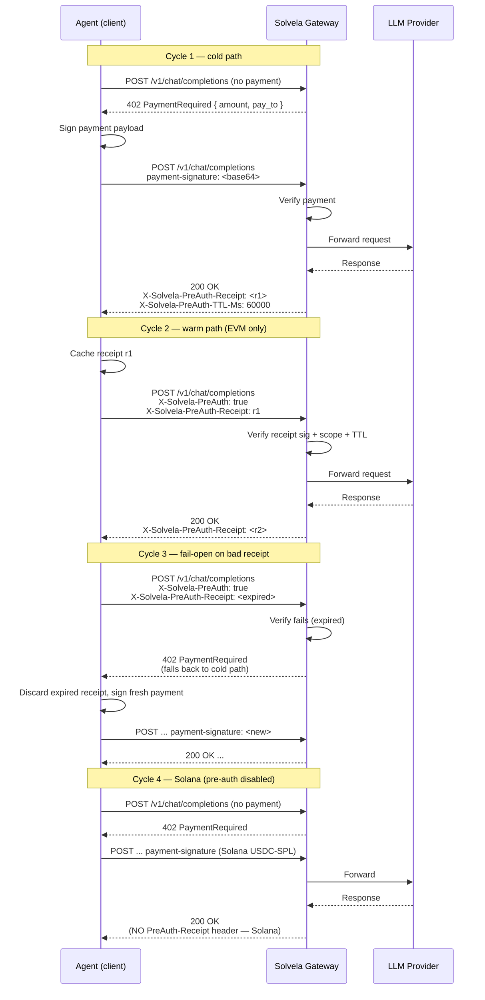

> **Status: specification only.** Pre-auth is not implemented in the gateway today. This page documents the protocol design Solvela will adopt when the optimization is wired in (slot: `crates/gateway/src/middleware/x402.rs`). Track follow-up at the bottom of this page.

## What it is

After a successful 402 → payment → 200 cycle for a given `(model, payer, amount)` tuple, the client may sign a *pre-authorized* payment payload for its **next** request to the same model. The gateway accepts the pre-signed payload directly, skipping the 402 round-trip and saving roughly **150–250ms** of wallclock time per call.

Pre-auth is opt-in client-side, advisory server-side, and **MUST be disabled on Solana** — see [Critical safety constraint](#critical-safety-constraint).

## Why it matters

Agentic loops typically issue 5–50 LLM calls per task: a planner call, a series of tool-use turns, a final consolidation. With a per-call 402 round-trip, that's 5–50 × ~200ms = 1–10 seconds of pure protocol overhead, on top of the LLM latency itself. Pre-auth collapses the protocol overhead to a single payload-signing operation per turn.

Reference inspiration: BlockRunAI/ClawRouter's `src/payment-preauth.ts` claims "~200ms per call" savings in production agentic workloads.

## Protocol shape

<Steps>
  <Step>
    **Cycle 1 (cold) — normal 402 dance**

    The agent sends a request without payment. The gateway returns `402` with a `PaymentRequired` body. The agent signs a payment payload and resends with `payment-signature: <base64>`. The gateway verifies, proxies to the LLM provider, returns `200` with the response.

    On the success response, the gateway includes a new header:

    ```http
    HTTP/1.1 200 OK
    Content-Type: application/json
    X-Solvela-PreAuth-Receipt: <base64-encoded-receipt>
    X-Solvela-PreAuth-TTL-Ms: 60000
    X-Solvela-PreAuth-Scope: model=auto;payer=GH...;amount_atomic=1234
    ```

    `X-Solvela-PreAuth-Receipt` is a server-signed receipt that authorizes the bearer to make ONE additional call to the same `(model, payer, amount)` within the TTL window without going through 402.
  </Step>

  <Step>
    **Cycle 2 (warm) — opt-in pre-auth**

    The agent caches the receipt locally. On its next request to the same model, the agent sets:

    ```http
    POST /v1/chat/completions
    X-Solvela-PreAuth: true
    X-Solvela-PreAuth-Receipt: <base64-encoded-receipt>
    Content-Type: application/json

    { "model": "auto", "messages": [...] }
    ```

    The agent does NOT send a `payment-signature` header on this request — the receipt is the proof of payment.
  </Step>

  <Step>
    **Gateway accepts or rejects**

    The gateway verifies the receipt's signature, scope (`model`/`payer`/`amount` must match the new request), and freshness (within TTL). On success, the request is proxied normally and a fresh receipt is issued in the response. On any verification failure, the gateway responds with `402 Payment Required` as if no pre-auth header were present — clients must handle this fail-open path.
  </Step>

  <Step>
    **Receipt rotation**

    Each successful cycle issues a fresh receipt. Receipts are NOT chainable — a single receipt authorizes exactly one subsequent call. This bounds the blast radius of a leaked receipt to one request's worth of inference cost.
  </Step>
</Steps>

### Receipt structure

The base64-decoded receipt is a JSON object signed by the gateway's HMAC key:

```json
{
  "v": 1,
  "iss": "solvela-gateway",
  "iat": 1730320000000,
  "exp": 1730320060000,
  "scope": {
    "model": "auto",
    "payer": "GHRkn...",
    "amount_atomic": "1234",
    "currency": "USDC"
  },
  "nonce": "01HG5...",
  "sig": "base64(hmac_sha256(secret, canonical_json(above)))"
}
```

The gateway's HMAC secret rotates per-deploy; receipts older than the most recent rotation become invalid. This is acceptable — clients fall back to the 402 path.

### Header reference

| Header                          | Direction         | Required when                | Notes                                                              |
|---------------------------------|-------------------|------------------------------|--------------------------------------------------------------------|
| `X-Solvela-PreAuth`             | client → server   | Opting into pre-auth         | Value: `true` (any other value treated as opt-out)                 |
| `X-Solvela-PreAuth-Receipt`     | both directions   | Always when pre-auth in use  | Base64-encoded JSON, see structure above                           |
| `X-Solvela-PreAuth-TTL-Ms`      | server → client   | Always on receipt issuance   | Hint to client; authoritative TTL is in receipt's `exp`            |
| `X-Solvela-PreAuth-Scope`       | server → client   | Always on receipt issuance   | Human-readable scope summary; `(model, payer, amount_atomic)`      |

## Critical safety constraint

> **Pre-auth MUST be disabled on Solana.**

Solana transactions reference a `recent_blockhash` that **expires in approximately 60–90 seconds**. A pre-signed Solana USDC-SPL transfer carries a specific blockhash; if the gateway accepts a stale pre-signed transaction the cluster *may* still land it within the validity window, *but the same signed payload could land in two different slots if replayed*, producing duplicate transfers — i.e., **double-charging the user's wallet**.

This is the same lesson BlockRunAI's ClawRouter learned and codified in `src/payment-preauth.ts` with the comment:

```ts
// Solana blockhash expires in ~60s; a stale pre-signed tx can double-charge
if (chain === 'solana') options.skipPreAuth = true;
```

Solvela's implementation MUST mirror this guard. The gateway-side check is:

1. The receipt's `scope.currency` indicates the payment chain.
2. If `scope.currency === "USDC-SPL"` (Solana), the gateway rejects the pre-auth header even if the receipt itself is valid, returning 402 instead.
3. Clients on Solana SHOULD NOT cache or send pre-auth receipts. The gateway omits the `X-Solvela-PreAuth-Receipt` header entirely on Solana payment success responses — there is nothing to cache.

This means **on Solana, pre-auth is a no-op** — the gateway behaves exactly as it does today.

## EVM applicability

When Solvela adds EVM support (Base / Ethereum / Polygon), pre-auth becomes safe because **EIP-3009 `TransferWithAuthorization`** payloads carry their own `validAfter` / `validBefore` timestamp window — there is no blockhash binding to slot timing. A pre-signed authorization can only be redeemed once (the contract's nonce mapping prevents replay), and only within the timestamp window the client encodes.

The receipt model maps cleanly:

- `scope.currency = "USDC-EVM-Base"` (or `-Ethereum`, etc.) gates pre-auth as ENABLED.
- The gateway's `validBefore` enforcement aligns with the receipt `exp`.
- The `nonce` field in the receipt mirrors EIP-3009's per-authorization nonce.

So the same opt-in client header set works for EVM with no protocol change beyond the chain-aware enablement gate.

## Replay protection — the failsafe

Even with pre-auth disabled on Solana and constrained on EVM, the gateway carries a defense-in-depth layer against accidentally-replayed pre-signed payments:

The existing **request-dedup cache** at `crates/gateway/src/cache.rs::request_dedup` computes a SHA-256 of the canonicalized request body (sorted keys, agent timestamp prefixes stripped) and caches the response for 30 seconds keyed on that hash. A client that retries the same request within 30s — pre-auth header or not — gets the cached response, NOT a fresh charge.

This means: even if a client mishandles its receipt cache and replays a request with both `X-Solvela-PreAuth-Receipt` and a fresh `payment-signature`, the gateway returns the cached response and does not double-charge.

Pre-auth and request-dedup are independent layers:

- **Pre-auth** is a *latency* optimization (skip the 402 round-trip).
- **Request-dedup** is a *correctness* guard (don't charge twice for the same logical request).

Both ship.

## Sequence diagram



## Failure modes and how the protocol handles them

<CardGroup cols={2}>
  <Card title="Receipt expired" icon="clock">
    Gateway returns 402 with `PaymentRequired` body. Client discards receipt and falls back to cold path. No charge.
  </Card>
  <Card title="Receipt scope mismatch" icon="shuffle">
    Client requested a different model, payer, or amount than the receipt covers. Gateway rejects with 402. No charge.
  </Card>
  <Card title="HMAC secret rotated" icon="key">
    Receipt was signed by the previous secret. Gateway returns 402. Client discards receipt and falls back. No charge.
  </Card>
  <Card title="Solana request with receipt" icon="ban">
    Gateway returns 402 unconditionally — Solana is not eligible for pre-auth regardless of receipt validity. No charge.
  </Card>
  <Card title="Both PreAuth-Receipt AND payment-signature sent" icon="layers">
    Gateway prefers `payment-signature` (the more authoritative proof) and ignores the receipt. Request-dedup catches accidental retries.
  </Card>
  <Card title="Receipt leaked / stolen" icon="alert-triangle">
    Attacker can redeem at most ONE call's worth of inference within TTL (single-use receipt, narrow scope). Bounded blast radius.
  </Card>
</CardGroup>

## Client-side implementation sketch

A client SDK should treat pre-auth as a transparent optimization: callers do not opt in per-call; the SDK manages the receipt cache.

```typescript
// pseudocode
class SolvelaClient {
  private receiptCache = new Map<string, Receipt>();

  async chatCompletion(req: ChatRequest): Promise<ChatResponse> {
    const scopeKey = `${req.model}:${this.payer}:${this.estimateAmount(req)}`;
    const cached = this.receiptCache.get(scopeKey);

    if (cached && this.chain === "evm" && !cached.isExpired()) {
      const res = await this.send(req, { preAuthReceipt: cached.encoded });
      if (res.status === 200) {
        this.receiptCache.set(scopeKey, res.headers.preAuthReceipt);
        return res;
      }
      // 402 — fall through to cold path; receipt was no good
      this.receiptCache.delete(scopeKey);
    }

    // cold path
    const cold = await this.send(req);
    if (cold.status === 402) {
      const signed = await this.signPayment(cold.body);
      const res = await this.send(req, { paymentSignature: signed });
      if (this.chain === "evm" && res.headers.preAuthReceipt) {
        this.receiptCache.set(scopeKey, res.headers.preAuthReceipt);
      }
      return res;
    }
    return cold;
  }
}
```

The Solana branch never enters the cached path — the gateway will not issue receipts there.

## Implementation TODO

When this spec is implemented:

1. **Slot:** `crates/gateway/src/middleware/x402.rs` — add a `PreAuthLayer` that runs *before* the existing `x402` middleware. On hit, sets `Extension<VerifiedPayment>` so the rest of the chain treats the request as paid. On miss or invalid receipt, removes the pre-auth headers and lets the request fall through to the normal 402 path.
2. **Receipt signing:** new module `crates/gateway/src/preauth.rs` — HMAC-SHA256 signer with rotating secrets. Reuse `ring::hmac` (already a transitive dep).
3. **Per-chain gate:** explicit `if matches!(chain, Chain::Solana) { return reject_preauth(); }` in the `PreAuthLayer`. Inline comment citing this page and ClawRouter's prior art.
4. **Client SDK changes:** the standalone `solvela-ts`, `solvela-python`, `solvela-go` repos and the in-monorepo `sdks/mcp` — receipt cache + opt-in header set. Solana code paths remain unchanged.
5. **Tests:**
   - Receipt round-trip (sign / verify / scope match)
   - Expired receipt → fall-through to 402
   - Solana request with receipt → 402 even when receipt valid
   - HMAC secret rotation invalidates old receipts
   - Both `payment-signature` and receipt sent → payment-signature wins
6. **Metrics:** `solvela_preauth_hit_total{chain}`, `solvela_preauth_miss_total{chain, reason}`, `solvela_preauth_savings_ms` histogram.

Until implemented, the headers above are reserved — clients setting them today get a normal 402 response (the gateway ignores unknown headers).
