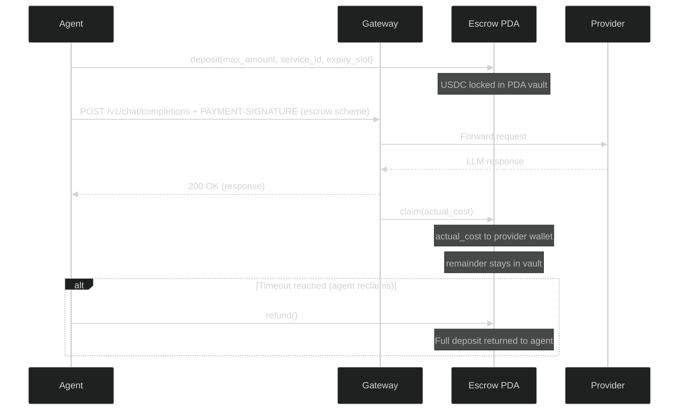

# Escrow System

The escrow system provides trustless USDC-SPL escrow for production payment settlement. An agent deposits funds into a PDA vault, the gateway claims the actual cost after delivering the response, and the agent can reclaim any remainder after a timeout.

## Overview

The escrow program is an Anchor program deployed on Solana. It lives in `programs/escrow/` and is **not** a workspace member (to avoid `thiserror` v1/v2 and `base64` version conflicts).

```admonish warning
The escrow program must be built and deployed separately with the Anchor CLI. It is not part of the standard `cargo build` workflow.
```

## Escrow Flow



## PDA Derivation

Escrow accounts are derived using Program Derived Addresses:

```
seeds = [b"escrow", agent.key().as_ref(), &service_id]
```

Where:
- `agent` is the depositing wallet's public key
- `service_id` is an arbitrary byte string identifying the service

## Instructions

### `deposit`

Creates or reuses an escrow account and locks USDC:

- `max_amount`: maximum USDC (atomic units, 6 decimals) to lock
- `service_id`: service identifier bytes
- `expiry_slot`: Solana slot after which the agent can reclaim funds

### `claim`

Called by the gateway (fee payer) after delivering the response:

- `actual_cost`: the actual USDC cost of the request (must be <= deposit)
- Transfers `actual_cost` to the provider wallet
- Remainder stays in the vault for the agent to reclaim

### `refund`

Called by the agent after `expiry_slot` has passed:

- Returns the full remaining deposit to the agent
- Closes the escrow account

## Claim Processing

The gateway runs a background claim processor that:

1. **Auto-starts on boot** when escrow + database are configured
2. **Queues claims** as requests are served
3. **Processes claims** with exponential backoff (1s to 5min, max 10 retries)
4. **Rotates fee payers** across configured hot wallets with health tracking and 60s cooldown
5. **Uses durable nonces** when configured (falls back to recent blockhash)
6. **Circuit breaker**: pauses claiming for 1 minute when >50% of claims fail within a 5-minute window
7. **Stale recovery**: in-progress claims older than 5 minutes are retried
8. **Graceful shutdown**: stops processing on SIGTERM via a `tokio::sync::watch` channel

## Fee Payer Rotation

Multiple hot wallets can be configured for fee payer rotation:

```bash
RCR_SOLANA_FEE_PAYER_KEY=<primary-base58-key>
RCR_SOLANA__FEE_PAYER_KEY_2=<second-key>
RCR_SOLANA__FEE_PAYER_KEY_3=<third-key>
```

The `FeePayerPool` tracks health per key:

- Successful claims reset the failure counter
- Failed claims increment the failure counter
- Keys with recent failures enter a 60-second cooldown
- The pool selects the healthiest available key for each claim

## Monitoring

### `/v1/escrow/config` (public)

Returns escrow configuration:

```json
{
  "program_id": "GTs7ik3NbW3xwSXq33jyVRGgmshNEyW1h9rxDNATiFLy",
  "current_slot": 298451623,
  "usdc_mint": "EPjFWdd5AufqSSqeM2qN1xzybapC8G4wEGGkZwyTDt1v"
}
```

### `/v1/escrow/health` (admin-gated)

Returns claim processor metrics:

```json
{
  "claims_submitted": 1250,
  "claims_succeeded": 1230,
  "claims_failed": 15,
  "claims_retried": 42,
  "queue_depth": 3,
  "circuit_breaker_open": false,
  "fee_payers_healthy": 2,
  "fee_payers_total": 3
}
```

Requires the `Authorization: Bearer <RCR_ADMIN_TOKEN>` header.

## Building the Escrow Program

```bash
cd programs/escrow
anchor build        # Compiles to .so + generates IDL
anchor deploy       # Deploy to localnet/devnet
```

```admonish tip
On Linux, if you encounter OpenSSL issues when testing the escrow program:
```

```bash
OPENSSL_NO_PKG_CONFIG=1 \
  OPENSSL_LIB_DIR=/usr/lib/x86_64-linux-gnu \
  OPENSSL_INCLUDE_DIR=/usr/include/openssl \
  cargo test --manifest-path programs/escrow/Cargo.toml
```
