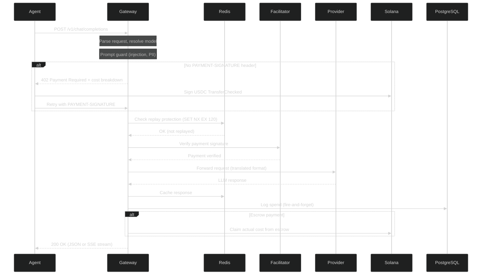

# How It Works

## Request Flow

Every request to `POST /v1/chat/completions` follows this sequence:



## Step-by-Step Breakdown

### 1. Request Parsing and Model Resolution

The gateway parses the incoming `ChatRequest` and resolves the `model` field. Three formats are accepted:

- **Direct model ID**: `"openai/gpt-4o"` -- used as-is
- **Alias**: `"auto"`, `"fast"`, `"cheap"`, `"best"`, `"reason"`, `"code"`, `"eco"` -- mapped to a routing profile
- **Smart routing profile**: `"eco"`, `"auto"`, `"premium"`, `"free"` -- the request is scored and the best model for that tier is selected

The `max_tokens` field is capped at 128,000 to prevent unbounded cost exposure.

### 2. Prompt Guard

Before any payment processing, the gateway runs prompt guard checks:

- **Injection detection**: patterns that attempt to override system prompts
- **Jailbreak detection**: attempts to bypass safety filters
- **PII detection**: personal information that should not be sent to third-party providers

Requests that trigger guards are rejected with a 400 error before any payment is charged.

### 3. Payment Check

The gateway checks for a `PAYMENT-SIGNATURE` header. If absent, it returns **HTTP 402 Payment Required** with:

- The recipient wallet address
- The USDC mint address
- The exact amount required (estimated from input tokens + `max_tokens`)
- A cost breakdown (input cost, output cost, platform fee)
- Accepted payment schemes (`exact` and optionally `escrow`)
- Chain and network information

### 4. Payment Verification

When the `PAYMENT-SIGNATURE` header is present, the gateway:

1. **Decodes** the header (base64 or raw JSON)
2. **Replay protection**: checks Redis (`SET NX EX 120` on the transaction signature) or the in-memory LRU fallback
3. **Signature verification**: validates the Solana transaction via the Facilitator
4. **Amount validation**: confirms the transferred amount meets or exceeds the quoted price
5. **Recipient validation**: confirms the transfer destination matches the gateway wallet

### 5. Provider Proxy

After payment verification, the gateway:

1. Selects the appropriate provider adapter (OpenAI, Anthropic, Google, xAI, DeepSeek)
2. Translates the request from OpenAI format to the provider's native format
3. Forwards the request with the provider's API key
4. Records provider request duration and errors for metrics

If the configured provider is unavailable (no API key or circuit breaker open), the gateway falls through to the stub `FallbackProvider` which returns 503.

### 6. Response Handling

The gateway supports two response modes:

- **JSON**: standard non-streaming response. The full response is cached in Redis.
- **SSE streaming**: server-sent events with `data:` frames containing `ChatChunk` objects. A heartbeat comment (`: heartbeat`) is sent periodically to keep the connection alive.

### 7. Post-Response

After returning the response to the client:

- **Spend logging**: a `SpendLogEntry` is written to PostgreSQL via `tokio::spawn` (fire-and-forget, never blocks the response)
- **Cache storage**: the response is stored in Redis with a TTL
- **Escrow claim**: if the payment used the escrow scheme, a claim transaction is queued for the actual cost (remainder refunded to the agent)

## Model Resolution Flow

```mermaid
%%{init: {'theme': 'dark', 'themeVariables': {'primaryColor': '#F97316', 'primaryTextColor': '#F0F0F4', 'primaryBorderColor': '#F97316', 'lineColor': '#9999AA', 'secondaryColor': '#2a2a2a', 'tertiaryColor': '#1a1a1a'}}}%%
flowchart TD
    A[model field] --> B{Is it a direct model ID?}
    B -->|"openai/gpt-4o"| C[Use directly]
    B -->|No| D{Is it a profile alias?}
    D -->|"auto", "eco", "premium", "free"| E[Score request across 15 dimensions]
    E --> F[Classify tier: Simple / Medium / Complex / Reasoning]
    F --> G["Resolve model from (profile, tier) table"]
    D -->|No| H[Return 400: unknown model]

    style E fill:#F97316,color:#F0F0F4
    style F fill:#F97316,color:#F0F0F4
```

## Data Flow Summary

| Stage | Blocking? | Storage |
|-------|-----------|---------|
| Request parsing | Yes | Memory |
| Prompt guard | Yes | Memory |
| Payment verification | Yes | Redis (or in-memory LRU) |
| Provider proxy | Yes | HTTP client |
| Response caching | No (fire-and-forget) | Redis |
| Spend logging | No (fire-and-forget) | PostgreSQL |
| Escrow claim | No (background queue) | Solana |

The critical path (request parsing through provider proxy) is the only blocking sequence. All persistence operations happen asynchronously via `tokio::spawn` to minimize latency.
