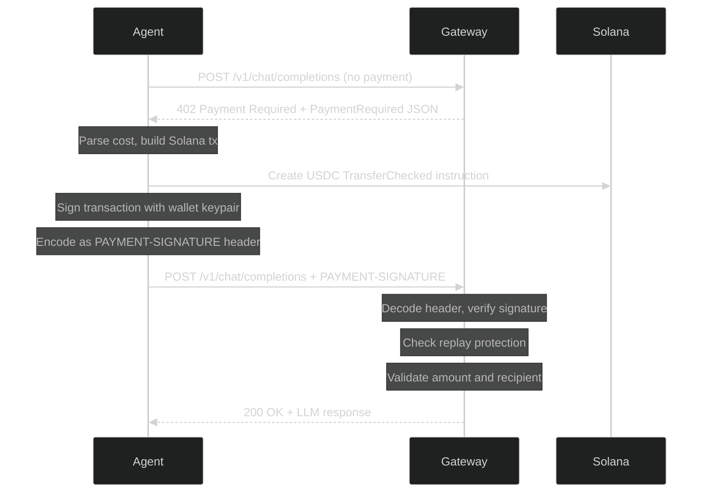

# x402 Payment Protocol

The [x402 protocol](https://www.x402.org/) is an HTTP-native payment protocol that uses the HTTP 402 status code ("Payment Required") as a machine-readable payment negotiation mechanism. Solvela implements x402 for Solana USDC-SPL payments.

## How x402 Works

The protocol follows a simple challenge-response pattern:



## PaymentRequired Response

When a request arrives without a `PAYMENT-SIGNATURE` header, the gateway returns a 402 with this JSON body:

```json
{
  "error": "payment_required",
  "payment_required": {
    "recipient_wallet": "7YkAz...gateway_pubkey",
    "usdc_mint": "EPjFWdd5AufqSSqeM2qN1xzybapC8G4wEGGkZwyTDt1v",
    "amount_usdc": "0.006563",
    "cost_breakdown": {
      "input_tokens_estimated": 150,
      "output_tokens_max": 500,
      "input_cost_usdc": "0.000375",
      "output_cost_usdc": "0.005000",
      "platform_fee_usdc": "0.000269",
      "platform_fee_percent": 5,
      "total_usdc": "0.006563"
    },
    "accepted_schemes": ["exact", "escrow"],
    "chain": "solana",
    "network": "devnet"
  }
}
```

### Field Reference

| Field | Type | Description |
|-------|------|-------------|
| `recipient_wallet` | `string` | Base58 Solana pubkey to send USDC to |
| `usdc_mint` | `string` | USDC-SPL mint address (mainnet: `EPjFWdd5AufqSSqeM2qN1xzybapC8G4wEGGkZwyTDt1v`) |
| `amount_usdc` | `string` | Total USDC amount required (decimal string) |
| `cost_breakdown.input_tokens_estimated` | `integer` | Estimated input tokens from the request |
| `cost_breakdown.output_tokens_max` | `integer` | Maximum output tokens (from `max_tokens` or model default) |
| `cost_breakdown.input_cost_usdc` | `string` | Input token cost (provider rate) |
| `cost_breakdown.output_cost_usdc` | `string` | Output token cost (provider rate) |
| `cost_breakdown.platform_fee_usdc` | `string` | 5% platform fee |
| `cost_breakdown.platform_fee_percent` | `integer` | Always 5 |
| `cost_breakdown.total_usdc` | `string` | Sum of input + output + platform fee |
| `accepted_schemes` | `string[]` | Payment schemes the gateway accepts |
| `chain` | `string` | Always `"solana"` |
| `network` | `string` | `"devnet"` or `"mainnet-beta"` |

## PAYMENT-SIGNATURE Header

The client signs a Solana transaction and attaches it to the retry request.

### Header Format

The header value is either:

1. **Base64-encoded** `PaymentPayload` JSON (preferred)
2. **Raw JSON** `PaymentPayload`

```json
{
  "scheme": "exact",
  "transaction": "<base58-encoded VersionedTransaction>",
  "agent_pubkey": "AgentWallet...",
  "amount_usdc": "0.006563"
}
```

For escrow payments:

```json
{
  "scheme": "escrow",
  "transaction": "<base58-encoded deposit tx>",
  "agent_pubkey": "AgentWallet...",
  "amount_usdc": "0.010000",
  "escrow_id": "escrow-service-id"
}
```

### Size Limit

The `PAYMENT-SIGNATURE` header is limited to 50KB. Larger headers are rejected with 400.

## Payment Schemes

### Exact Payment (`"exact"`)

The agent sends a pre-signed `TransferChecked` instruction transferring the exact quoted amount from the agent's USDC ATA to the gateway's USDC ATA.

- **Pros**: simple, immediate settlement
- **Cons**: agent pays the max estimated cost upfront; no refund for unused output tokens

### Escrow Payment (`"escrow"`)

The agent deposits USDC into a trustless Anchor escrow PDA. After the LLM response is delivered, the gateway claims only the actual cost. The remainder is refundable by the agent after a timeout.

- **Pros**: agent only pays for actual usage; trustless (on-chain escrow)
- **Cons**: requires escrow program deployment; two transactions instead of one

Escrow is only offered when `SOLVELA_SOLANA_ESCROW_PROGRAM_ID` and `SOLVELA_SOLANA_FEE_PAYER_KEY` are configured.

See [Escrow System](./escrow.md) for details.

## Replay Protection

Every transaction signature is tracked to prevent double-spending:

1. **Redis** (primary): `SET NX EX 120` on the transaction signature. If the key already exists, the payment is rejected as a replay.
2. **In-memory LRU** (fallback): when Redis is unavailable, an LRU cache of 10,000 signatures provides degraded-mode protection.

The 120-second TTL is sufficient because Solana transaction signatures become invalid after ~60 seconds (blockhash expiry).

## Verification Pipeline

The gateway verifies payments through the Facilitator module:

1. **Decode**: base64 or raw JSON parsing of the `PAYMENT-SIGNATURE` header
2. **Replay check**: Redis `SET NX` or in-memory LRU
3. **Transaction deserialization**: parse the Solana `VersionedTransaction`
4. **Instruction validation**: verify it contains a `TransferChecked` instruction with the correct discriminator
5. **ATA derivation**: compute the expected Associated Token Accounts for sender and recipient
6. **Amount validation**: transferred amount >= quoted amount
7. **Recipient validation**: destination ATA matches the gateway wallet's USDC ATA
8. **USDC mint validation**: the token mint matches the configured USDC mint address

Any failure in the pipeline returns a 400 or 401 error with a descriptive message (without leaking internal details).
