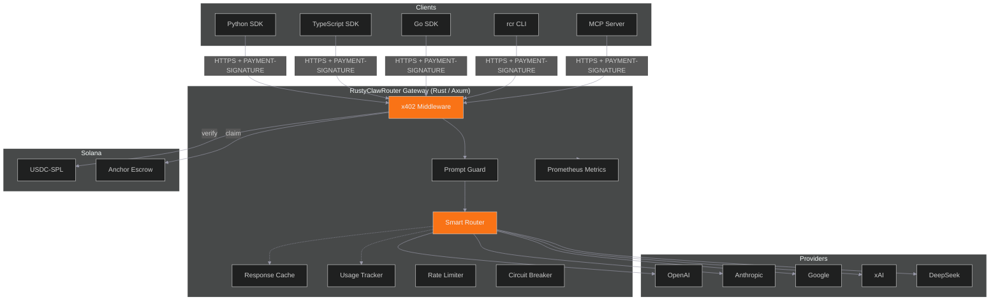

# RustyClawRouter

RustyClawRouter is a Solana-native AI agent payment gateway built in Rust. AI agents pay for LLM API calls with USDC-SPL on Solana via the x402 protocol. No API keys, no accounts, just wallets.

## What Problem Does This Solve

Traditional LLM API access requires account creation, API key management, credit card billing, and monthly invoices. For autonomous AI agents operating at scale, this model breaks down:

- Agents cannot create accounts or manage billing cycles
- API keys are static credentials that can leak
- Per-organization billing does not map to per-agent cost attribution
- Settlement happens days or weeks after usage

RustyClawRouter replaces all of this with a single primitive: **pay-per-request with USDC on Solana**. An agent holds a wallet, signs a payment for each request, and receives the LLM response. Settlement is immediate. Attribution is automatic (wallet address = identity).

## Architecture

## Workspace Structure

| Crate | Role |
|-------|------|
| `gateway` | The only binary. Axum HTTP server with routes, middleware, provider proxies, usage tracking, caching, and `ServiceRegistry`. |
| `x402` | Pure protocol library. Solana verification, escrow integration, fee payer pool, nonce pool. No Axum dependency. |
| `router` | 15-dimension rule-based request scorer, routing profiles (eco/auto/premium/free), model registry. |
| `protocol` | Shared wire-format types (`rustyclaw-protocol`). Payment types, OpenAI-compatible chat types, model info. Published to crates.io. |
| `cli` | `rcr` CLI binary: wallet, chat, models, health, stats, doctor commands. |

The Anchor escrow program lives in `programs/escrow/` and is **not** a workspace member to avoid dependency version conflicts.

## Key Design Principles

1. **Gateway is the only binary** -- all other crates are libraries
2. **`x402` has no Axum dependency** -- pure protocol library, no HTTP framework coupling
3. **`PaymentVerifier` trait is chain-agnostic** -- designed for future EVM/Base support
4. **Provider adapters translate OpenAI to native format** -- gateway always speaks OpenAI format externally
5. **5% platform fee on all requests** -- always included in the cost breakdown
6. **Solana-first** -- Base/EVM is a future extension point, not implemented today
7. **Never store private keys** -- wallet keys stay client-side; only signed transactions reach the gateway
8. **Both PostgreSQL and Redis are optional** -- gateway degrades gracefully when either is absent

## Current State

- 316 gateway tests (221 unit + 95 integration)
- 79 x402 protocol tests
- 13 router tests
- 18 protocol tests
- 5 providers, 22+ models
- SDKs: Python, TypeScript, Go, MCP
- Prometheus metrics instrumentation
- Trustless escrow with claim recovery
- Service marketplace with SSRF prevention
